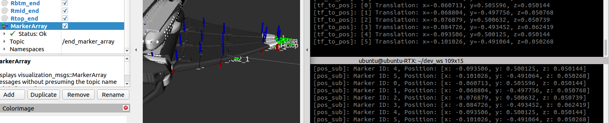

# tf_to_pos

This is a ROS 2 package that gets the end effector position from a tf msg.

## Supported ROS 2 distributions

[![humble][humble-badge]][humble]
[![ubuntu22][ubuntu22-badge]][ubuntu22]

## Requirements
- Ubuntu OS PC
  - Ubuntu 22.04 Humble

## Usage

1. Set target frames to use.

Set the target frame from tf_to_pos_component.cpp.
```cpp:tf_to_pos_component.cpp
  // Set target frames to subscribe, line 34.
  target_frames_ = {
    "lf_foot_link", "lh_foot_link", "rf_foot_link", "rh_foot_link"
  };
```

2. To run the example.

```sh: Terminal
colcon build --packages-select tf_to_pos
. install/setup.bash
ros2 run tf_to_pos tf_to_pos
```

```sh: Terminal
colcon build --packages-select tf_to_pos
. install/setup.bash
ros2 run tf_to_pos pos_sub
```



## License
This repository is licensed under the MIT license, see LICENSE.

[humble-badge]: https://img.shields.io/badge/-HUMBLE-orange?style=flat-square&logo=ros
[humble]: https://docs.ros.org/en/humble/index.html

[ubuntu22-badge]: https://img.shields.io/badge/-UBUNTU%2022%2E04-blue?style=flat-square&logo=ubuntu&logoColor=white
[ubuntu22]: https://releases.ubuntu.com/jammy/
